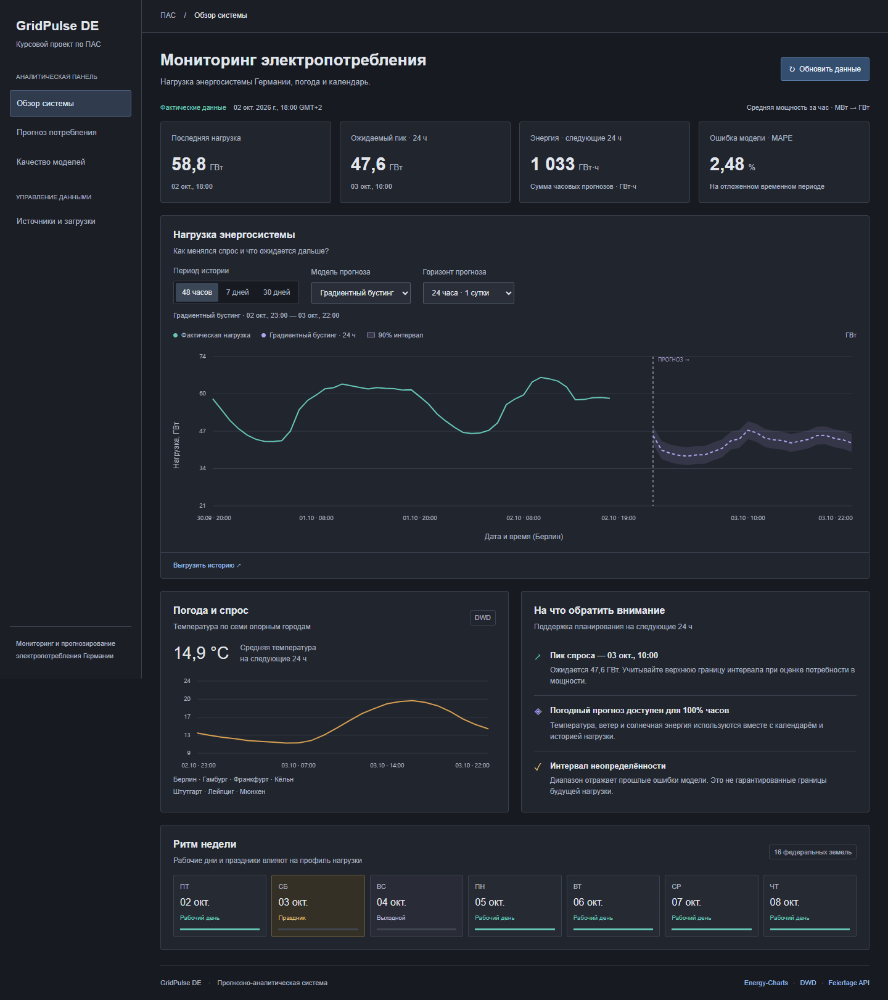
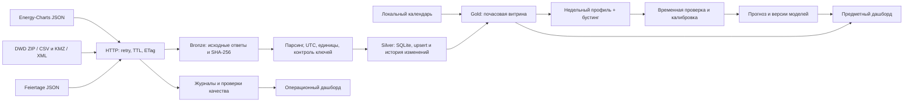

# GridPulse DE

Локальная прогнозно-аналитическая система почасового потребления электроэнергии Германии с учётом погоды и производственного календаря. Реализована по требованиям «ПАС УД.pdf». Исходная тетрадка и документ пользователя сохранены.

**Сайт:** http://127.0.0.1:8050 · **Репозиторий:** https://github.com/RomkaBro1/EnergyConsumptionPAS



## Быстрый запуск

Нужен Python 3.11–3.13; разработка и проверка выполнены на Windows, Python 3.13. Интернет требуется для первоначальной установки и обновления внешних данных. Уже подготовленные данные и прогноз работают локально без интернета. Node.js, API-ключи, облачный аккаунт и внешние CDN не требуются.

В PowerShell из каталога проекта:

```powershell
powershell -ExecutionPolicy Bypass -File .\start.ps1
```

Скрипт создаст `.venv`, установит зависимости и запустит сервис. Откройте **http://127.0.0.1:8050**. Первая подготовка существующего набора занимает около минуты. Если `data_germany_energy` отсутствует, автоматически запускается полная загрузка из интернета; она занимает существенно больше времени из-за архивов и ограничений API. Ход работы виден на странице. Для остановки нажмите Ctrl+C в окне сервера.

Эквивалентные команды для ручного управления:

```powershell
python -m venv .venv
.\.venv\Scripts\python.exe -m pip install -r requirements.txt
.\.venv\Scripts\python.exe run.py serve
```

Если зависимости уже установлены, достаточно `python run.py`.

```powershell
python run.py prepare   # импорт существующих CSV, витрина, обучение и прогноз без сетевых запросов
python run.py refresh   # догрузка источников, витрина, обучение и прогноз
python run.py serve     # сайт и автоматическое обновление каждые 6 часов
```

`prepare` требует существующих CSV или уже наполненной локальной базы. На чистом клоне используйте `refresh` либо `serve`. Установка зависимостей выполняется отдельно и требует сети. Не запускайте тетрадку для работы сайта: парсеры выделены в независимые модули.

## Что доступно в интерфейсе

- **Обзор системы:** последняя фактическая нагрузка, ожидаемый пик, энергия выбранного периода, график факта и прогноза, погода и календарь недели. Прямо над графиком «Нагрузка энергосистемы» можно выбрать модель (бустинг / недельный профиль) и горизонт (24, 72 или 168 часов). График, интервал, показатели и погодная панель обновляются автоматически. Период истории выбирается отдельно: 48 часов, 7 или 30 дней.
- **Прогноз потребления:** 24, 72 или 168 часов, две модели, 90% номинальный интервал, пять пиковых часов, сценарий температуры от −10 до +10 °C, выгрузка CSV.
- **Качество моделей:** MAE, RMSE, MAPE, фактическое покрытие интервала, ошибки по горизонту, протокол временной проверки и версия модели.
- **Источники и загрузки:** количество записей, сохранённые проверки качества, журнал HTTP и запусков, история исправлений, цепочка происхождения фактического показателя.

Кнопка **«Обновить данные»** запускает полный конвейер в фоне. Повторное нажатие во время выполнения не запускает второй экземпляр. При недоступности одного источника остальные продолжают работу; ошибки и частичный результат явно показываются. Доступны последние сохранённые данные.

## Источники и измерения

| Источник | Способ получения | Применение |
|---|---|---|
| [Energy-Charts](https://api.energy-charts.info/) | REST `/public_power`, JSON, ряд `Load` | Нагрузка Германии |
| [DWD CDC](https://opendata.dwd.de/climate_environment/CDC/observations_germany/climate/hourly/) | ZIP с CSV, каталоги станций | Температура, ветер и солнечная энергия |
| [DWD MOSMIX](https://opendata.dwd.de/weather/local_forecasts/mos/MOSMIX_L/) | KMZ с KML/XML | Прогноз погоды по семи городам |
| [Feiertage API](https://feiertage-api.de/) | Годовой JSON по 16 землям | Текущий и следующий календарные годы |
| [python-holidays](https://holidays.readthedocs.io/) | Версионированная локальная библиотека | Исторический календарь и автономный резерв |

В базе — МВт и UTC. `МВт × длительность интервала / 3600` даёт МВт·ч. За полный час средняя мощность в МВт численно равна энергии этого часа в МВт·ч. На экране мощность отображается в ГВт, суммарная энергия — в ГВт·ч. Частичные часы не выдаются за полные. Календарь и подписи времени — Europe/Berlin; дни перехода времени имеют 23/25 часов.

Погодные города: Берлин, Гамбург, Франкфурт, Кёльн, Штутгарт, Лейпциг, Мюнхен. Среднее имеет равные веса опорных городов; это приближённый индикатор погоды Германии. Станции наблюдений и MOSMIX могут отличаться. Региональный календарь не учитывает графики отдельных предприятий и школьные каникулы; неоднозначные муниципальные события API не превращаются в обязательный выходной всей земли.

## Архитектура и хранение



| Путь | Ответственность |
|---|---|
| `data_germany_energy/` | Существующие результаты тетрадки, только чтение со стороны сервиса |
| `runtime/bronze/objects/` | Исходные ответы, имя файла = SHA-256 |
| `runtime/bronze/requests/` | URL, ETag, Last-Modified, время проверки и получения |
| `runtime/bronze/import.json` | Хэш импортированного CSV и ссылка на исходный архив тетрадки |
| `runtime/silver.sqlite` | Текущие нормализованные записи, версии, запуски, события, качество |
| `runtime/gold/` | Часовая витрина, календарь, прогноз и результаты валидации CSV |
| `runtime/models/` | Модели с хэшами, версиями и протоколами проверки |
| `runtime/quarantine/` | Описания загрузок, которые не удалось разобрать или получить |

Повторные бизнес-записи не дублируются; изменившиеся значения сохраняются в `history` до обновления. Новая нагрузка догружается с семидневным перекрытием для исправлений источника. При повторной загрузке DWD получает только актуальные архивы; исторические файлы на обычном обновлении не запрашиваются. Источники с файловым API требуют скачивания всего изменившегося архива, после чего применяется фильтр временного окна. TTL и условные HTTP-запросы сокращают обращения. Сетевые попытки и запуски журналируются каждый раз — это аудит, а не дубликаты наблюдений.

Парсеры отвергают несовместимую схему, неверные единицы, дубли ключей и перекрывающиеся интервалы. Отсутствующая нагрузка не интерполируется. Погода с недопустимыми значениями становится пропуском. Сохраняются проверки полноты, уникальности, допустимости, календарной связности и актуальности. При ошибке нового запроса старая история сохраняется. Записи и история меняются одной транзакцией SQLite; файлы записываются через атомарную замену. Межпроцессная блокировка защищает конвейер от одновременного CLI/веб-запуска.

## Прогноз и воспроизводимость

1. **Недельный профиль:** нагрузка 168 часов назад. Если соответствующего измерения нет — медиана прошлых наблюдений по локальному дню недели и часу.
2. **Градиентный бустинг:** `HistGradientBoostingRegressor`, 180 итераций, 24 листа, фиксированный seed. Признаки: лаги 168/336 часов, температура, ветер, солнечная энергия, градусо-часы отопления/охлаждения, календарь и циклическая сезонность. Пропуски погодных признаков обрабатываются моделью.

Используются последние 1095 дней. Минимум для обучения — 60 суток фактической нагрузки. Последние 28 дней отделяются от обучения. Недельные окна проверки используют только предшествующую нагрузку и выпуски погоды с `issue_time <= origin`. Если архивного прогноза нет, погодный профиль рассчитывается только по прошлым наблюдениям. Первые 14 дней проверочного периода калибруют интервал, следующие 14 — оценивают метрики. Затем итоговая модель переобучается на всей доступной истории.

90% интервал построен по квантили абсолютных ошибок калибровки. Это эмпирический интервал, а не гарантия покрытия, особенно при смене режима или длительном отсутствии свежих измерений. Сохраняются его фактическое покрытие на тесте, SHA-256 модели, хэш входной витрины, список признаков и границы выборок.

Последний зафиксированный эксперимент: тест **16.09.2026 20:00 — 30.09.2026 19:00 UTC**, 336 часов:

| Модель | MAE, МВт | RMSE, МВт | MAPE | Покрытие 90% интервала |
|---|---:|---:|---:|---:|
| Бустинг | 1150,43 | 1537,27 | 2,27% | 92,56% |
| Недельный профиль | 1496,66 | 1960,58 | 2,92% | 92,56% |

**Ограничение эксперимента:** архивные прогнозы DWD не покрывают этот тест; здесь использован исторический сезонный погодный профиль. Тест пока охватывает две недели и не доказывает годовую устойчивость. На горизонте 1–24 ч недельный профиль в этом эксперименте лучше по MAE; бустинг выигрывает в целом. Актуальные результаты всегда показываются в интерфейсе и `runtime/models/latest.json`.

## Настройки

Основной файл — `config.json`, другой файл задаётся `python run.py --config path.json`. Доступны `GRIDPULSE_DATA_DIR`, `GRIDPULSE_IMPORT_DIR`, `GRIDPULSE_HOST`, `GRIDPULSE_PORT`, `GRIDPULSE_REFRESH_MINUTES`, `GRIDPULSE_CUSTOM_CA_FILE`.

- `refresh_minutes: 360`: автоматическая загрузка раз в 6 часов, пока запущен сайт; `0` отключает расписание.
- `history_start`: начало первичной загрузки; `train_days`: размер обучающей истории.
- `validation_days`: число дней проверки, кратное 14; по умолчанию 28.
- `http_timeout`, `http_attempts`, `energy_request_gap`: таймаут, повторы и интервал запросов Energy-Charts.
- `custom_ca_file`: доверенный PEM сертификат организации при HTTPS-прокси. Проверка TLS не отключается.

Сайт привязан к loopback и проверяет Host/Origin. Он предназначен для локального использования, без многопользовательской авторизации. Для фоновой работы без открытого сайта можно вызывать `python run.py refresh` по расписанию Windows Task Scheduler. При каждом запуске `serve` внутренний шестичасовой таймер начинается заново.

## Проверки

```powershell
python -m unittest discover -s tests -v
```

22 автоматических теста проверяют физические единицы, неполные часы, DST, календарь, идемпотентность и историю, блокировку записи, отсутствие утечки будущей погоды, обработку отсутствующих фактов, API, HTTP 429/304, таймауты, кэш и отдельную догрузку запаздывающих солнечных наблюдений. Все тесты изолированы от рабочей базы.

Браузерная проверка (дополнительная зависимость, установленный Edge и запущенный сервис):

```powershell
python -m pip install -r requirements-dev.txt
python tools/browser_smoke.py
```

Проверяются четыре раздела, сценарий +5 °C, 168-часовой CSV, мобильная ширина 390 px и отсутствие JavaScript-ошибок. Снимки сохраняются в `test-results/`. Запускать из корня проекта.

## Материалы для защиты

- [Соответствие требованиям методички](docs/requirements.md).
- [Отчёт](docs/report.md), [отчёт Word](docs/report.docx).
- [Презентация HTML](docs/presentation.html), [PDF](docs/presentation.pdf).
- [Схема архитектуры Mermaid](docs/architecture.mmd).
- [Протокол эксперимента](docs/validation.json).
- [История изменений](CHANGELOG.md).

Проект не публикует исходные данные, обученные бинарные модели и локальные базы в Git. Они воспроизводятся конвейером. История существующего репозитория сохранена; новые этапы оформлены отдельными коммитами. Историю разработки за прошедший семестр нельзя восстановить задним числом. Согласование темы с преподавателем и загрузка материалов в СДО остаются организационными действиями автора.
